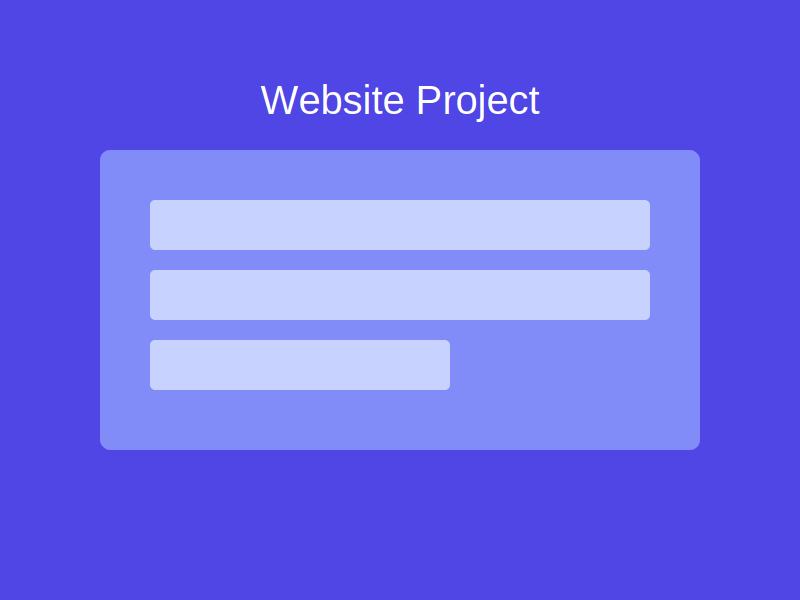
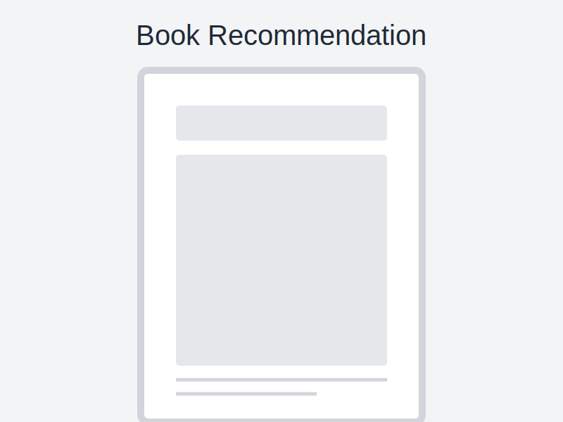

# Social Media Analytics Web App

A responsive Next.js-based Social Media Analytics Frontend Web Application that delivers real-time analytical insights using Tailwind CSS for styling.

[](https://youtu.be/TICjTo5VYJU)



> **Note:** Due to time constraints, I wasn't able to access external social media APIs, so I created mock API endpoints with hardcoded values to demonstrate the functionality.

## API Access Proof

I attempted to access the API endpoints at http://20.244.56.144/test/register and http://20.244.56.144/test/auth. Below are the details of the API interactions:

### Registration Endpoint
```json
{
  "companyName": "vidya jyothi institute of technology",
  "ownerName": "raashed",
  "rollNo": "22911A7239",
  "ownerEmail": "mohammedraashed10@gmail.com",
  "accessCode": "XyIvvM"
}
```

This returned:
```json
{
  "companyName": "vidya jyothi institute of technology",
  "clientID": "dcaad181-caf6-4254-a232-5ec7b1c96f62",
  "clientSecret": "CkUKFfMSOaFLyMwu",
  "ownerName": "raashed",
  "ownerEmail": "mohammedraashed10@gmail.com",
  "rollNo": "22911A7239"
}
```

### Authentication Endpoint
Using the credentials from registration, I received an authentication token:
```json
{
  "token_type": "Bearer",
  "access_token": "eyJhbGciOiJIUzI1NiIsInR5cCI6IkpXVCJ9...",
  "expires_in": 1743153044
}
```

## Application Screenshots

Here are screenshots of the working application with the mock data:

### Feed Page

*The Feed page displays the latest posts with user information, content, images, and comments. Posts are sorted by timestamp with the newest appearing first.*

### Top Users Page

*The Top Users page shows the five users with the highest post count, displaying their avatars, names, usernames, and post counts.*

### Trending Posts Page

*The Trending Posts page displays posts with the maximum number of comments, showing detailed information about each post and its comments.*

## Features

### 1. Feed Page
- Displays posts in real-time with the newest posts appearing first
- Shows user information, post content, images, and comments
- Auto-refreshes every 30 seconds to show the latest content
- Responsive design that works on mobile, tablet, and desktop devices

### 2. Top Users Page
- Displays the top five users with the highest post count
- Shows user profile pictures, names, usernames, and post counts
- Visually appealing cards with ranking indicators

### 3. Trending Posts Page
- Shows posts with the maximum number of comments
- Displays detailed information about each post and all its comments
- Enhanced visual styling for trending content

## Technology Stack

- **Frontend**: Next.js 15.2.4 with App Router
- **Styling**: Tailwind CSS 4.0
- **State Management**: React Hooks (useState, useEffect)
- **Data Fetching**: Native fetch API with polling for real-time updates
- **Fonts**: Geist Sans and Geist Mono from Next.js font optimization

## API Endpoints

The application uses the following mock API endpoints:

- `/api/users` - Returns a list of users sorted by post count
- `/api/posts` - Returns a list of posts sorted by timestamp (newest first)
- `/api/trending` - Returns posts with the maximum number of comments

## Getting Started

### Prerequisites

- Node.js 18.0 or later
- npm or yarn package manager

### Installation

1. Clone the repository:

```bash
git clone https://github.com/yourusername/social-media-analytics-web-app.git
cd social-media-analytics-web-app
```

2. Install dependencies:

```bash
npm install
# or
yarn install
```

3. Run the development server:

```bash
npm run dev
# or
yarn dev
```

4. Open [http://localhost:3000](http://localhost:3000) with your browser to see the application.

## Project Structure

```
├── app/                  # Next.js App Router directory
│   ├── api/              # API routes
│   │   ├── posts/        # Posts API endpoint
│   │   ├── trending/     # Trending posts API endpoint
│   │   └── users/        # Users API endpoint
│   ├── top-users/        # Top Users page
│   ├── trending/         # Trending Posts page
│   ├── globals.css       # Global CSS styles
│   ├── layout.tsx        # Root layout component
│   └── page.tsx          # Feed page (home)
├── public/               # Static assets
│   └── images/           # Image assets
│       ├── posts/        # Post images
│       └── users/        # User avatars
├── next.config.ts        # Next.js configuration
├── package.json          # Project dependencies and scripts
├── postcss.config.mjs    # PostCSS configuration
└── tailwind.config.js    # Tailwind CSS configuration
```

## Responsive Design

The application is fully responsive and works on:
- Mobile devices (< 640px)
- Tablets (640px - 1024px)
- Desktops (> 1024px)

Tailwind CSS is used for responsive styling with breakpoints for small (sm), medium (md), and large (lg) screens.

## Performance Optimization

- Efficient data fetching with API polling
- Image optimization with Next.js Image component
- Responsive loading states and error handling
- Conditional rendering to minimize DOM elements

## License

This project is licensed under the MIT License - see the LICENSE file for details.
